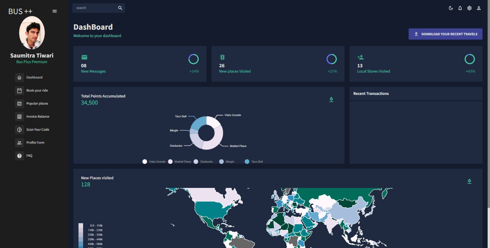
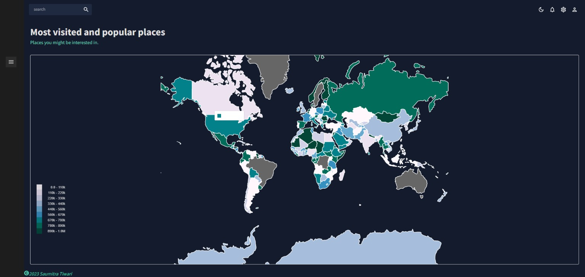
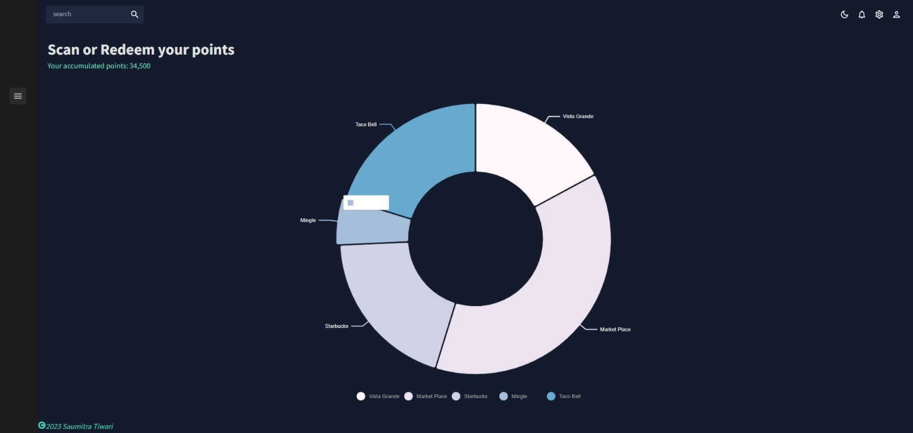
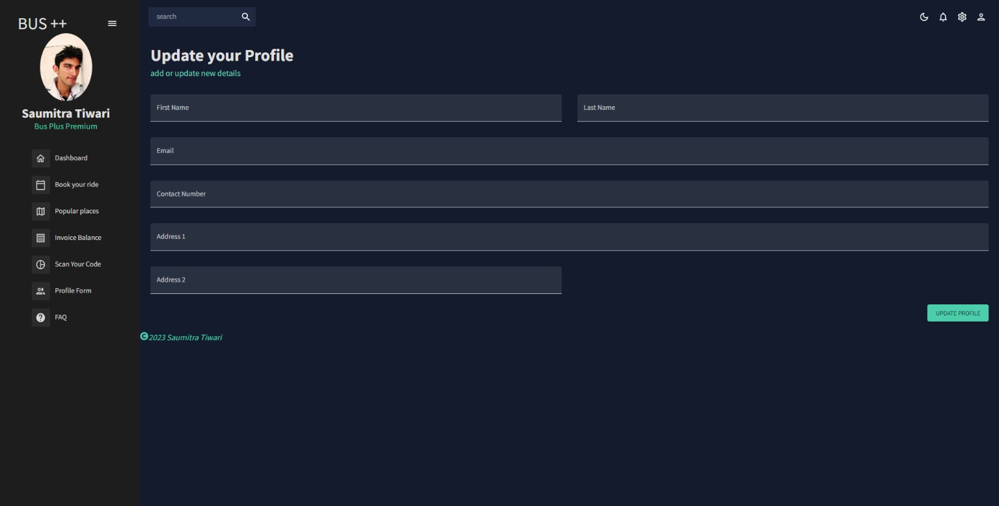
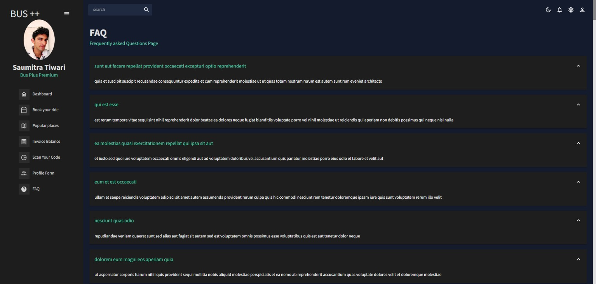

# Vehicle related problems that we have in SLO
1. Cars emit significant amounts of carbon, contributing to the overall increase in carbon emissions in the environment. In addition, the large number of cars on the road leads to traffic congestion, causing longer commute times and hindering productivity. Moreover, cars take up a significant amount of space on roads, parking lots, and garages, which could be used for other purposes.

2. The limited use of public transportation leads to limited funding, which in turn results in limited bus routes and reduced service to many areas. This can make it difficult for individuals who depend on public transportation to get around and can also contribute to increased traffic congestion.

3. Buses often make unnecessary stops, which can lead to longer commute times and waste valuable time for passengers. Additionally, buses may stop at locations that are empty, rather than adjusting their route to account for changing passenger demand. This can result in inefficiencies in the transportation system and decreased satisfaction for riders.

## A quick Comparison

From Cal Poly's campus to Target on '1190 LOS OSOS Valley Rd,
1. Car takes about 9 mins to get there.
2. With bike it roughly takes about 15 mins to get there.
3. With Transit it takes about 30 mins to get there. 

### Solution
1. Increase use of mass transit and other public transportation alternatives.
2. Introduce a bus-on-demand system for faster, more efficient bus rides.
3. Induce demand for public transportation with a value-add incentive program.

### Market Viability
1. Growing market indicates sufficient interest and demand
2. Robustness of program is evidenced in its survival of the pandemic, with a smaller percent reduction in use than traditional transport solutions.
3. Bus+ has additional incentive program to further encourage use.

### Competetion
Carpooling with Uber and Lyft
1. Capacity is limited.
2. Pricing is subjected to demand and highly variable.
3. Lack of incentive program means no ancillary benifits to local community.

## Application layout/design
### 1. Dashboard
Modern UI design with easy access of all the components at one place.

### 2. Popular Places
The layout shows the most visited and popular places in SLO, the city layout and backend is currently in process so currently displaying a world map as a placeholder.

### 3. Points accumulated and redeem Section
This feature is responsible for monitoring your ride points as well as the number of points that have been redeemed during your most recent visit.

### 4. Profile Form
This component gives users access to make the changes to their existing profile.

### 5. FQA component

Note: Some of the front-end components are still being developed and there is still a significant amount of work to be done on the backend. The API calls made at this point are sourced from the API placeholder.

##An initial glimpse of the prototype.

## Fastest and most optimal path of the Buses routes
1. The main problem with the buses is that there path is fixed and they cover each stops at a given fixed time.
2. To solve this issue I'm focusing on the model that would pre sort the location of the users based on their prebookings(starting locations and destinations).
3. By the number of users given at a certain time and within certain range of the area, we find the closest dynamic stops for them and pick them up from that location.
4. Using the A* algorithm we will find the shortest path to the destination and will try to connect the other stops as well. 
5. There are number of variables that is needed to be addressed here, for example how many stops can/should we cover from point A to point B?, how big of a range of area should we check for users such that it becomes easy for them to access the ride, finding the shortest path or covering the maximum stops which issue to focus first and when?
6. Currently working on this model right now and would require some further assistances.
